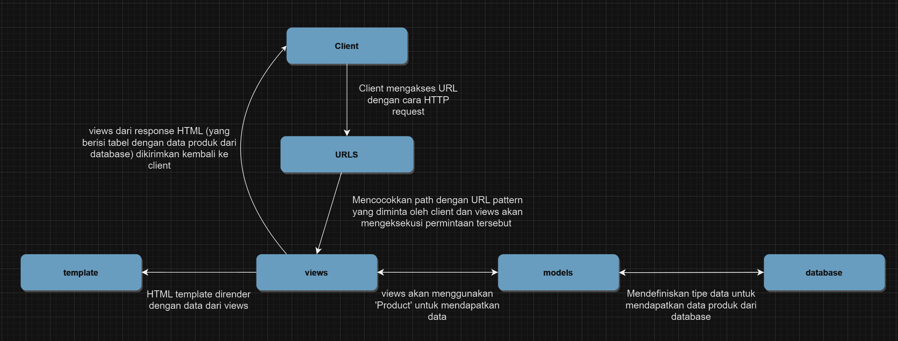

Nama    : Ammara Pranahiza Widaryati
NPM     : 2206083022
Kelas   : PBP B

1. Jelaskan bagaimana cara kamu mengimplementasikan checklist di atas secara step-by-step (bukan hanya sekadar mengikuti tutorial).
a. Membuat sebuah proyek Django baru.
-->
    1. Buat berkas requirements.txt yang akan berisi daftar dependensi yang dibutuhkan oleh proyek, seperti Django, Gunicorn, Whitenoise, psycopg2-binary, Requests, dan urllib3.

    2. Setelah menuliskan daftar dependensi dalam berkas requirements.txt, langkah selanjutnya adalah menginstal semua dependensi ini menggunakan perintah 'pip install -r requirements.txt.' Pastikan sudah mengaktifkan virtual environment sebelum menjalankan perintah ini.

    3. Untuk membuat struktur awal proyek Django yang diperlukan dalam memulai pengembangan aplikasi web. Buatlah proyek Django baru dengan nama yang diinginkan menggunakan perintah 'django-admin startproject "nama yang diinginkan" .'

    4. Dalam berkas settings.py tambahkan * pada ALLOWED_HOSTS yang berfungsi melihat daftar host yang diizinkan untuk mengakses aplikasi web.

    5. Jalankan server Django dengan menggunakan perintah python manage.py runserver lalu akses http://localhost:8000 pada peramban web untuk melihat tanda animasi roket, yang berarti proyek Django telah berhasil dibuat dan sedang berjalan. Jika ingin melihat isi dari main.html tambahkan '/main' pada akhir link tersebut.

    6. Menghentikan server pengembangan, dengan cara tekan Ctrl+C dan nonaktifkan env dengan cara 'deactivate'.

    7. Menambahkan berkas .gitignore yang berfungsi untuk mengabaikan berkas dan direktori dalam git, agar berkas yang tercantum dalam .gitignore tidak dapat dimasukkan ke dalam versi kontrol git

    8. Melakukan add, commit, dan push

b. Membuat aplikasi dengan nama main pada proyek tersebut.
--> Pada langkah a3 sudah dijelaskan bagaimana cara membuat aplikasi dengan nama main pada proyek tersebut. Lalu, hal yang perlu dilakukan sudah dijelaskan pada nomor 4, 5, dan 6. 

c. Melakukan routing pada proyek agar dapat menjalankan aplikasi main.
--> Dalam berkas urls.py di dalam proyek, tambahkan path atau rute yang akan mengarahkan ke aplikasi main.views dengan menambahkan kode berikut ke dalam file urls.py:
        from django.contrib import admin
        from django.urls import path, include

        urlpatterns = [
            path('admin/', admin.site.urls),
            path('main/', include('main.urls')),
        ]
    Hal ini dilakukan agar  dapat memisahkan dan mengorganisasi kode dan view aplikasi "main" dengan baik, dan untuk mengatur URL yang akan digunakan untuk mengakses berbagai bagian dari situs web. Dalam contoh ini aplikasi main akan memenuhi permintaan mengakses URL dan view akan ditampilkan.

d. Membuat model pada aplikasi main dengan nama Item dan memiliki atribut wajib sebagai berikut.
name sebagai nama item dengan tipe CharField.
amount sebagai jumlah item dengan tipe IntegerField.
description sebagai deskripsi item dengan tipe TextField.
--> Dalam berkas models.py dalam direktori main. Definiskan model Product dengan atribut yang diinginkan, seperti:
    class Product(models.Model):
        name = models.CharField(max_length=255)
        amount = models.IntegerField()
        description = models.TextField()
        category = models.TextField()

e. Membuat sebuah fungsi pada views.py untuk dikembalikan ke dalam sebuah template HTML yang menampilkan nama aplikasi serta nama dan kelas kamu.
--> Dalam berkas views.py dalam direktori main tambahkan fungsi yang berisi variabel baru dengan penjelasannya, dan bentuk tabel yang ingin ditampilkan pada web.

f. Membuat sebuah routing pada urls.py aplikasi main untuk memetakan fungsi yang telah dibuat pada views.py.
--> Dalam berkas urls.py dalam direktori main tambahkan routing yang berfungsi untuk mengatur rute URL terkait dengan aplikasi main. Menggunakan show_main dari modul main.views agar dapat menghasilkan tampilan ketika URL diakses. Lalu, tambahkan juga 'path('main/', include('main.urls'))' pada berkas urls.py dalam direktori perpuspacil agar rute URL dalam aplikasi main dapat diimpor kedalam urls.py proyek.

g. Melakukan deployment ke Adaptable terhadap aplikasi yang sudah dibuat sehingga nantinya dapat diakses oleh teman-temanmu melalui Internet.
--> 1. Login ke Adaptable dengan GitHub dan pilih All Repositories
    2. Pilih repositori yang baru dibikin untuk tugas ini dan pilih branch yang akan digunakan untuk deployment branch.
    3. Pilih Python App Template sebagai template deployment.
    4. Pilih PostgreSQL sebagai tipe basis data.
    5. Pilih versi Python sesuai dengan komputer.
    6. Pada bagian Start Command masukkan perintah 'python manage.py migrate && gunicorn shopping_list.wsgi'. Hal ini dilakukan untuk memastikan bahwa basis data diperbarui dengan migrasi terbaru dan aplikasi Django dijalankan menggunakan server aplikasi Gunicorn.
    7. Masukkan nama aplikasi sesuai keiinginan, nantinya nama aplikasi akan menjadi domain situs web aplikasi.
    8. Centang bagian HTTP Listener on PORT dan klik Deploy App untuk memulai proses deployment aplikasi.

2. Buatlah bagan yang berisi request client ke web aplikasi berbasis Django beserta responnya dan jelaskan pada bagan tersebut kaitan antara urls.py, views.py, models.py, dan berkas html.

3. Jelaskan mengapa kita menggunakan virtual environment? Apakah kita tetap dapat membuat aplikasi web berbasis Django tanpa menggunakan virtual environment?
--> Virtual environment berfungsi untuk mengisolasi package serta dependencies dari aplikasi sehingga akan mencegah terjadinya konflik dengan proyek lain yang ada pada komputer. Selain itu, dengan menggunakan virtual environment dapat menciptakan lingkungan proyek di komputer lain dengan mudah sekaligus dapat menjamin bahwa proyek akan berjalan dengan benar tanpa masalah dependencies.
--> Sebenarnya kita tetap bisa membuat aplikasi web berbasis Django tanpa menggunakan virtual environment, tetapi potensi untuk mendapatkan masalah dependencies, konflik, dan manajemen yang ribet akan meningkat. Sebab, virtual environment sangat membantu dalan pengembangan perangkat lunak di python dan membantu mengatasi masalah-masalah yang sudah disebutkan diatas.

4. Jelaskan apakah itu MVC, MVT, MVVM dan perbedaan dari ketiganya.
--> MVC (Model-View-Controller): adalah pola arsitektur untuk membuat aplikasi dengan cara memisakan kode menjadi bagian-bagian seperti berikut:
- Model digunakan untuk mengelola data dan logika bisnis yang diminta dalam database.
- View digunakan untuk menampilkan informasi yang disediakan oleh model kepada pengguna dalam bentuk grafis.
- Controller digunakan untuk mengendalikan alur logika aplikasi dengan cara menjadi penghubung antara Model dan View lalu mengatur bagaimana data yang akan ditampilkan di view.

--> MVT (Model-View-Template): adalah pola desain untuk mengembangkan aplikasi dari web. Terdiri dari berikut: 
- Model digunakan untuk mengelola seluruh data dan mendefinikasn struktur data dalam aplikasi Django. 
- View digunakan untuk mengelola, memproses dan mengembalikan HTTP. Selain itu, digunakan untuk mengambil data dan memenuhi permintaan model. 
- Template digunakan untuk mengatur tampilan akhir kepada pengguna, kalau dalan Django template menggunakan bahasa templating, yaitu "Django Template Language". Biasanya berupa file text yang jenisnya dapat berupa HTML, XML, dll.

--> MVVM (Model-View-ViewModel): adalah arsitektur yang berbasis GUI untuk pemisahan antara kode dan logika bisnis. MVVM terbagi menjadi beberapa macam, yaitu:
- Model digunakan untuk mengelola data yang akan digunakan dalam logika bisnis. 
- View untuk menampilkan UI dari aplikasi untuk mengatur bagaimana tampilan yang akan ditampilkan kepada pengguna, view di MVVM tampilannya pasif dan berubah mengikuti ViewModel. 
- ViewModel digunakan untuk perantara yang mengubah data dari Model ke format yang dapat ditampilkan oleh View.

--> Perbedaan utamanya ialah terkait logika bisnis dan tampilan. Perbedaan lainnya, yaitu:
MVC: 
- input langsung ke controller untuk mengontrol model dan view
- hubungannya menyeluruh antara view dan controller
- view tidak bisa mengakses controller

MVT
- input ke view untuk menerima permintaan HTTP
- hubungan controller individu dengan framework
- template tidak bisa mengakses view

MVVM
- input langsung ke controller
- hubungannya individu antara viewmodel dan view
- viewmodel tidak bisa mengakses view

Referensi
- Abdullah, A. Y. (2022, April 20). Tips Design Pattern MVVM pada Pengembangan Aplikasi Android. Retrieved from dicoding: https://www.dicoding.com/blog/tips-design-pattern-mvvm/
- Dang, A. T. (2020, September 27). MVC vs MVP vs MVVM. Retrieved from levelup: https://levelup.gitconnected.com/mvc-vs-mvp-vs-mvvm-35e0d4b933b4
- Kshatriya, S. S. (n.d.). What is MVT structure in Django? Retrieved from educative: https://www.educative.io/answers/what-is-mvt-structure-in-django
- Rajan, V. (2022, June). Django-MVT architecture. Retrieved from Medium: https://awstip.com/django-mvt-architecture-a9bfe52a469a
- Rony, S. (2021, September 29). Apa Itu MVC? Pahami Konsepnya dengan Baik. Retrieved from dicoding: https://www.dicoding.com/blog/apa-itu-mvc-pahami-konsepnya/