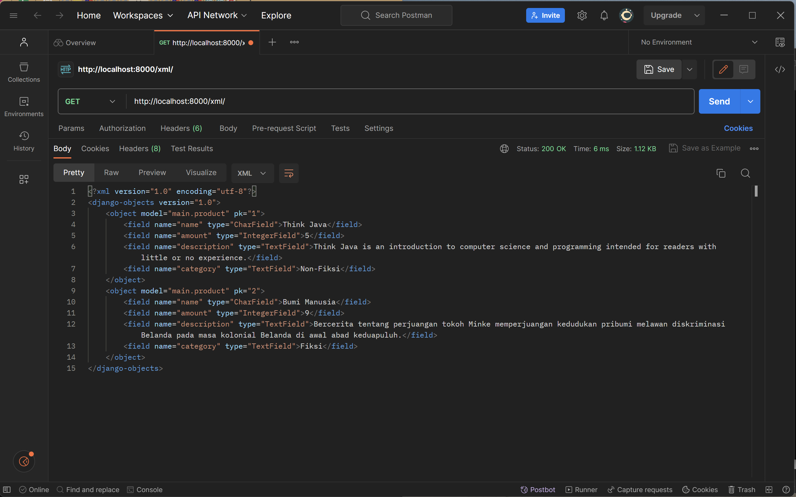
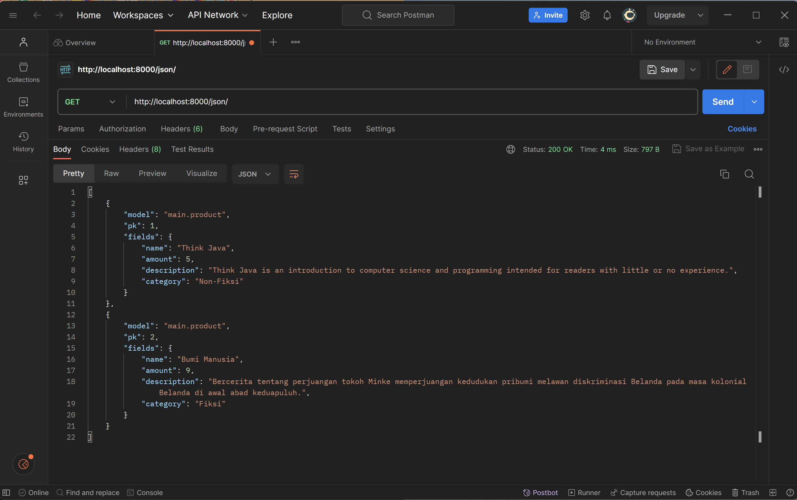

Nama    : Ammara Pranahiza Widaryati
NPM     : 2206083022
Kelas   : PBP B

1. Jelaskan bagaimana cara kamu mengimplementasikan checklist di atas secara step-by-step (bukan hanya sekadar mengikuti tutorial).
a. Membuat sebuah proyek Django baru.
-->
    1. Buat berkas requirements.txt yang akan berisi daftar dependensi yang dibutuhkan oleh proyek, seperti Django, Gunicorn, Whitenoise, psycopg2-binary, Requests, dan urllib3.

    2. Setelah menuliskan daftar dependensi dalam berkas requirements.txt, langkah selanjutnya adalah menginstal semua dependensi ini menggunakan perintah 'pip install -r requirements.txt.' Pastikan sudah mengaktifkan virtual environment sebelum menjalankan perintah ini.

    3. Untuk membuat struktur awal proyek Django yang diperlukan dalam memulai pengembangan aplikasi web. Buatlah proyek Django baru dengan nama yang diinginkan menggunakan perintah 'django-admin startproject "nama yang diinginkan" .'

    4. Dalam berkas settings.py tambahkan * pada ALLOWED_HOSTS yang berfungsi melihat daftar host yang diizinkan untuk mengakses aplikasi web.

    5. Jalankan server Django dengan menggunakan perintah python manage.py runserver lalu akses http://localhost:8000 pada peramban web untuk melihat tanda animasi roket, yang berarti proyek Django telah berhasil dibuat dan sedang berjalan. Jika ingin melihat isi dari main.html tambahkan '/main' pada akhir link tersebut.

    6. Menghentikan server pengembangan, dengan cara tekan Ctrl+C dan nonaktifkan env dengan cara 'deactivate'.

    7. Menambahkan berkas .gitignore yang berfungsi untuk mengabaikan berkas dan direktori dalam git, agar berkas yang tercantum dalam .gitignore tidak dapat dimasukkan ke dalam versi kontrol git

    8. Melakukan add, commit, dan push

b. Membuat aplikasi dengan nama main pada proyek tersebut.
--> Pada langkah a3 sudah dijelaskan bagaimana cara membuat aplikasi dengan nama main pada proyek tersebut. Lalu, hal yang perlu dilakukan sudah dijelaskan pada nomor 4, 5, dan 6. 

c. Melakukan routing pada proyek agar dapat menjalankan aplikasi main.
--> Dalam berkas urls.py di dalam proyek, tambahkan path atau rute yang akan mengarahkan ke aplikasi main.views dengan menambahkan kode berikut ke dalam file urls.py:
        from django.contrib import admin
        from django.urls import path, include

        urlpatterns = [
            path('admin/', admin.site.urls),
            path('main/', include('main.urls')),
        ]
    Hal ini dilakukan agar  dapat memisahkan dan mengorganisasi kode dan view aplikasi "main" dengan baik, dan untuk mengatur URL yang akan digunakan untuk mengakses berbagai bagian dari situs web. Dalam contoh ini aplikasi main akan memenuhi permintaan mengakses URL dan view akan ditampilkan.

d. Membuat model pada aplikasi main dengan nama Item dan memiliki atribut wajib sebagai berikut.
name sebagai nama item dengan tipe CharField.
amount sebagai jumlah item dengan tipe IntegerField.
description sebagai deskripsi item dengan tipe TextField.
--> Dalam berkas models.py dalam direktori main. Definiskan model Product dengan atribut yang diinginkan, seperti:
    class Product(models.Model):
        name = models.CharField(max_length=255)
        amount = models.IntegerField()
        description = models.TextField()
        category = models.TextField()

e. Membuat sebuah fungsi pada views.py untuk dikembalikan ke dalam sebuah template HTML yang menampilkan nama aplikasi serta nama dan kelas kamu.
--> Dalam berkas views.py dalam direktori main tambahkan fungsi yang berisi variabel baru dengan penjelasannya, dan bentuk tabel yang ingin ditampilkan pada web.

f. Membuat sebuah routing pada urls.py aplikasi main untuk memetakan fungsi yang telah dibuat pada views.py.
--> Dalam berkas urls.py dalam direktori main tambahkan routing yang berfungsi untuk mengatur rute URL terkait dengan aplikasi main. Menggunakan show_main dari modul main.views agar dapat menghasilkan tampilan ketika URL diakses. Lalu, tambahkan juga 'path('main/', include('main.urls'))' pada berkas urls.py dalam direktori perpuspacil agar rute URL dalam aplikasi main dapat diimpor kedalam urls.py proyek.

g. Melakukan deployment ke Adaptable terhadap aplikasi yang sudah dibuat sehingga nantinya dapat diakses oleh teman-temanmu melalui Internet.
--> 1. Login ke Adaptable dengan GitHub dan pilih All Repositories
    2. Pilih repositori yang baru dibikin untuk tugas ini dan pilih branch yang akan digunakan untuk deployment branch.
    3. Pilih Python App Template sebagai template deployment.
    4. Pilih PostgreSQL sebagai tipe basis data.
    5. Pilih versi Python sesuai dengan komputer.
    6. Pada bagian Start Command masukkan perintah 'python manage.py migrate && gunicorn shopping_list.wsgi'. Hal ini dilakukan untuk memastikan bahwa basis data diperbarui dengan migrasi terbaru dan aplikasi Django dijalankan menggunakan server aplikasi Gunicorn.
    7. Masukkan nama aplikasi sesuai keiinginan, nantinya nama aplikasi akan menjadi domain situs web aplikasi.
    8. Centang bagian HTTP Listener on PORT dan klik Deploy App untuk memulai proses deployment aplikasi.

2. Buatlah bagan yang berisi request client ke web aplikasi berbasis Django beserta responnya dan jelaskan pada bagan tersebut kaitan antara urls.py, views.py, models.py, dan berkas html.

3. Jelaskan mengapa kita menggunakan virtual environment? Apakah kita tetap dapat membuat aplikasi web berbasis Django tanpa menggunakan virtual environment?
--> Virtual environment berfungsi untuk mengisolasi package serta dependencies dari aplikasi sehingga akan mencegah terjadinya konflik dengan proyek lain yang ada pada komputer. Selain itu, dengan menggunakan virtual environment dapat menciptakan lingkungan proyek di komputer lain dengan mudah sekaligus dapat menjamin bahwa proyek akan berjalan dengan benar tanpa masalah dependencies.
--> Sebenarnya kita tetap bisa membuat aplikasi web berbasis Django tanpa menggunakan virtual environment, tetapi potensi untuk mendapatkan masalah dependencies, konflik, dan manajemen yang ribet akan meningkat. Sebab, virtual environment sangat membantu dalan pengembangan perangkat lunak di python dan membantu mengatasi masalah-masalah yang sudah disebutkan diatas.

4. Jelaskan apakah itu MVC, MVT, MVVM dan perbedaan dari ketiganya.
--> MVC (Model-View-Controller): adalah pola arsitektur untuk membuat aplikasi dengan cara memisakan kode menjadi bagian-bagian seperti berikut:
- Model digunakan untuk mengelola data dan logika bisnis yang diminta dalam database.
- View digunakan untuk menampilkan informasi yang disediakan oleh model kepada pengguna dalam bentuk grafis.
- Controller digunakan untuk mengendalikan alur logika aplikasi dengan cara menjadi penghubung antara Model dan View lalu mengatur bagaimana data yang akan ditampilkan di view.

--> MVT (Model-View-Template): adalah pola desain untuk mengembangkan aplikasi dari web. Terdiri dari berikut: 
- Model digunakan untuk mengelola seluruh data dan mendefinikasn struktur data dalam aplikasi Django. 
- View digunakan untuk mengelola, memproses dan mengembalikan HTTP. Selain itu, digunakan untuk mengambil data dan memenuhi permintaan model. 
- Template digunakan untuk mengatur tampilan akhir kepada pengguna, kalau dalan Django template menggunakan bahasa templating, yaitu "Django Template Language". Biasanya berupa file text yang jenisnya dapat berupa HTML, XML, dll.

--> MVVM (Model-View-ViewModel): adalah arsitektur yang berbasis GUI untuk pemisahan antara kode dan logika bisnis. MVVM terbagi menjadi beberapa macam, yaitu:
- Model digunakan untuk mengelola data yang akan digunakan dalam logika bisnis. 
- View untuk menampilkan UI dari aplikasi untuk mengatur bagaimana tampilan yang akan ditampilkan kepada pengguna, view di MVVM tampilannya pasif dan berubah mengikuti ViewModel. 
- ViewModel digunakan untuk perantara yang mengubah data dari Model ke format yang dapat ditampilkan oleh View.

--> Perbedaan utamanya ialah terkait logika bisnis dan tampilan. Perbedaan lainnya, yaitu:
MVC: 
- input langsung ke controller untuk mengontrol model dan view
- hubungannya menyeluruh antara view dan controller
- view tidak bisa mengakses controller

MVT
- input ke view untuk menerima permintaan HTTP
- hubungan controller individu dengan framework
- template tidak bisa mengakses view

MVVM
- input langsung ke controller
- hubungannya individu antara viewmodel dan view
- viewmodel tidak bisa mengakses view

Referensi
- Abdullah, A. Y. (2022, April 20). Tips Design Pattern MVVM pada Pengembangan Aplikasi Android. Retrieved from dicoding: https://www.dicoding.com/blog/tips-design-pattern-mvvm/
- Dang, A. T. (2020, September 27). MVC vs MVP vs MVVM. Retrieved from levelup: https://levelup.gitconnected.com/mvc-vs-mvp-vs-mvvm-35e0d4b933b4
- Kshatriya, S. S. (n.d.). What is MVT structure in Django? Retrieved from educative: https://www.educative.io/answers/what-is-mvt-structure-in-django
- Rajan, V. (2022, June). Django-MVT architecture. Retrieved from Medium: https://awstip.com/django-mvt-architecture-a9bfe52a469a
- Rony, S. (2021, September 29). Apa Itu MVC? Pahami Konsepnya dengan Baik. Retrieved from dicoding: https://www.dicoding.com/blog/apa-itu-mvc-pahami-konsepnya/

TUGAS 3

1. Apa perbedaan antara form POST dan form GET dalam Django?

a. Reload
Post: Data akan di-submit ulang dan user akan diberi peringatan bahwa data akan di-submit ulang
Get: Tidak akan mengubah data

b. Bookmarked
Post: Tidak cocok untuk di bookmark atau berbagi URL karena data tidak terlihat dalam URL.
Get: Bisa di bookmark atau berbagi URL karena data terlihat dalam URL sehingga mudah jika ingin disalin atau disimpan.

c. Cached
Post: tidak bisa di-cache oleh browser atau server web, karena biasanya server akan mengubah data.
Get: bisa di-cache oleh browser dan server web, yang dapat menyebabkan masalah jika data yang dikirimkan dalam permintaan GET adalah data yang sering berubah.

d. Encoding Type
Post: application/x-www-form-urlencoded or multipart/form-data.
Get: application/x-www-form-urlencoded

e. History
Post: Parameter tidak ada di dalam riwayat browser
Get: Parameter tetap ada di dalam riwayat browser

f. Security dan Visibility
Post: Data sensitif akan lebih aman sebab tidak terlihat dalam URL dan pihak ketiga akan lebih sulit menembus akses.
Get: Data akan terlihat dalam URL sehingga akan kurang aman.

2. Apa perbedaan utama antara XML, JSON, dan HTML dalam konteks pengiriman data?

a. XML: Digunakan untuk pertukaran data antar sistem yang berbeda dengan banyak variabel, penyimpanan data, dan konfigurasi. XML menyimpan data dalam struktur pohon dan bersifat kompleks dan kurang fleksibel sehingga memakan banyak ruang. Biasanya XML akan digunakan dalam berbagai macam, seperti dalam layanan web, konfigurasi file, dan pertukaran data yang lebih formal. 

b. JSON: Digunakan dalam pertukaran data antar aplikasi berbasis web dan server, serta menyediakan format yang lebih ringkas. Format JSON menggunakan struktur peta dengan pasangan key-value. JSON bersifat sederhana dan lebih fleksibel, sehingga memiliki ukuran file yang lebih kecil dan transmisi data yang lebih cepat. JSON biasa digunakan untuk API REST karena mudah dalam parsing data menggunakan JavaScript di sisi klien. 

c. HTML: Digunakan untuk membuat halaman web yang dapat dilihat oleh user melalui browser web. HTML tidak digunakan untuk pertukaran data tanpa diolah antar aplikasi atau layanan dan penyimpanan data. Sintaks HTML sangat sederhana dan mudah dimengerti.

3. Mengapa JSON sering digunakan dalam pertukaran data antara aplikasi web modern?

JSON sering digunakan dalam pertukaran data antara aplikasi web modern sebab memiliki beberapa keunggulan, diantaranya:

a. Memiliki struktur data yang fleksibel. Objek dan array bertingkat dapat disimpan sehingga memungkinkan representasi data yang kompleks dan terstruktur. 

b. Mudah dibaca dan ringkas sebab JSON menggunakan sintaks yang mirip dengan JavaScript dan membuatnya mudah untuk diinterpretasi oleh pengembang.

c. JSON memiliki format yang ringan, yang berarti ukuran payload data JSON akan lebih kecil disbanding format lainnya, hal ini akan mengurangi beban jaringan dan mempercepat transfer data antara klien dan server.

d. JSON dapat digunakan dalam berbagai banyak bahasa pemrograman, sehingga parsing dan pembuatan data JSON bisa dilakukan dengan mudah.

4.	Jelaskan bagaimana cara kamu mengimplementasikan checklist di atas secara step-by-step (bukan hanya sekadar mengikuti tutorial). 

a. Mengatur Routing dari main/ ke /
    - Pada langkah ini, ubah pengaturan routing agar aplikasi dapat mengarahkan ke halaman utama ("/").
    - Ini dilakukan dengan membuka berkas "urls.py" dalam folder "inventory_pbp" dan mengubah path dari "main/" menjadi kosong ("").
    - Setelah mengubahnya, simpan perubahan dan jalankan server menggunakan perintah "python manage.py runserver".

b. Implementasi Skeleton sebagai Kerangka Views
    - Buat folder "templates" di direktori utama.
    - Buat berkas "base.html" yang berisi kode kerangka dasar tampilan yang telah disediakan.
    - Sesuaikan pengaturan TEMPLATES di berkas "settings.py" agar "base.html" dapat dikenali sebagai berkas template.
    - Ubah kode dalam berkas "main.html" di direktori "main" sehingga menggunakannya sebagai template utama.

c. Membuat Form Input Data dan Menampilkan Data Produk Pada HTML
    - Langkah ini berfokus pada pembuatan formulir input data dan tampilan produk pada halaman HTML.
    - Buat berkas "forms.py" dalam direktori "main" untuk mendefinisikan struktur form "ProductForm".
    - Buka berkas "views.py" dalam folder "main" dan impor yang diperlukan.
    - Tambahkan fungsi "create_product" untuk mengelola form input data produk.
    - Modifikasi fungsi "show_main" untuk mengambil semua objek "Product".
    - Tambahkan path URL untuk "create_product" dalam berkas "urls.py" di direktori "main".
    - Buat berkas "create_product.html" untuk menampilkan formulir input data produk.

d.	Menggunakan Form Input Data
    - Pada langkah ini, akan ditampilkan data produk dalam bentuk tabel pada halaman utama.
    - Tambahkan tombol "Add New Product" yang akan mengarahkan pengguna ke halaman formulir input data dalam berkas "main.html".

Selain langkah-langkah di atas, tambahkan juga lima fungsi views tambahan untuk melihat objek yang telah ditambahkan dalam format HTML, XML, JSON, XML berdasarkan ID, dan JSON berdasarkan ID. Setiap langkah memiliki penjelasan dan tindakan yang sesuai, seperti:

a.	Menambahkan data dengan format HTML
    - Membuat folder "templates" dalam direktori "main".
    - Di dalam folder "templates", membuat berkas HTML yang berisi kode HTML untuk menampilkan daftar produk.

b.	Mengembalikan Data dalam Bentuk XML
    - Menggunakan HttpResponse dan serializers untuk mengembalikan data dalam format XML.
    - Membuat fungsi "show_xml" dalam "views.py" untuk menampilkan data dalam format XML.
    - Mengambil semua data dari model "Product" dalam fungsi "show_xml".
    - Menggunakan serializers.serialize() untuk mengubah data menjadi format XML.
    - Mengembalikan respons dengan data hasil serialisasi dan tipe konten "application/xml".
    - Menambahkan path URL untuk mengakses fungsi "show_xml" dalam "urls.py" di direktori "main".

c.	Mengembalikan Data dalam Bentuk JSON
    - Menggunakan HttpResponse dan serializers untuk mengembalikan data dalam format JSON.
    - Membuat fungsi "show_json" dalam "views.py" untuk menampilkan data dalam format JSON.
    - Mengambil semua data dari model "Product" dalam fungsi "show_json".
    - Menggunakan serializers.serialize() untuk mengubah data menjadi format JSON.
    - Mengembalikan respons dengan data hasil serialisasi dan tipe konten "application/json".
    - Menambahkan path URL untuk mengakses fungsi "show_json" dalam "urls.py" di direktori "main".

d.	Mengembalikan Data Berdasarkan ID dalam Bentuk XML dan JSON
    - Membuat dua fungsi baru, "show_xml_by_id" dan "show_json_by_id," untuk mengambil data berdasarkan ID dalam format XML dan JSON.
    - Dalam kedua fungsi tersebut, data diambil dari model "Product" berdasarkan ID.
    - Menggunakan serializers.serialize() untuk mengubah data menjadi format XML atau JSON tergantung pada fungsi yang dipanggil.
    - Mengembalikan respons dengan data hasil serialisasi dan tipe konten yang sesuai (XML atau JSON).
    - Menambahkan path URL untuk mengakses fungsi "show_xml_by_id" dan "show_json_by_id" dengan menyertakan parameter ID.

Dengan mengikuti langkah-langkah ini, aplikasi akan dapat mengelola objek model, menampilkan data dalam berbagai format, dan mengakses data berdasarkan ID.

5. Mengakses kelima URL di poin 2 menggunakan Postman, membuat screenshot dari hasil akses URL pada Postman, dan menambahkannya ke dalam README.md.
- screenshot dari hasil akses HTML pada Postman

- screenshot dari hasil akses XML pada Postman

- screenshot dari hasil akses JSON pada Postman

- screenshot dari hasil akses XML by ID pada Postman

- screenshot dari hasil akses JSON by ID pada Postman

Referensi
- Apa Perbedaan Antara JSON dan XML? (n.d.). Retrieved from https://aws.amazon.com/id/compare/the-difference-between-json-xml/.
- Arora, N. (2021, August 16). Render HTML Forms (GET & POST) in Django. Retrieved from geeksforgeeks.org: https://www.geeksforgeeks.org/render-html-forms-get-post-in-django/
- HTTP Request Methods. (n.d.). Retrieved from https://www.w3schools.com/tags/ref_httpmethods.asp.
- Jaiswal, A. (n.d.). JSON: Introduction, Benefits, Applications, and Drawbacks. Retrieved from turing.com: https://www.turing.com/kb/what-is-json

TUGAS 4

1. Apa itu Django UserCreationForm, dan jelaskan apa kelebihan dan kekurangannya?
Django UserCreationForm adalah pembuatan formulir untuk sign-up. Hal ini berguna untuk mengumpulkan informasi akun pengguna, seperti username, password, password confirmation, dan email.

Kelebihan:
- Penggunaan yang mudah karena syntax sudah disediakan oleh Django
- Validasi kata sandi bawaan untuk memastikan bahwa kata sandi dan konfirmasi kata sandi sudah cocok
- Formulir sudah terintegrasi dengan baik oleh sistem otentikasi Django, sehingga akan mudah untuk membuat akun pengguna.

Kekurangan:
- Keterbatasan kustomisasi, jika ingin mengubah formulir sesuai dengan keinginan sendiri maka diperlukan formulir kustom sendiri.
- Untuk informasi pengguna tambahan atau kasus pengguna kompleks maka UserCreationForm tidak akan cukup
- Jika ada fitur lanjutan seperti autentikasi sosial atau pengelolaan profil pengguna yang lengkap maka akan memakan waktu untuk integrasinya

2. Apa perbedaan antara autentikasi dan otorisasi dalam konteks Django, dan mengapa keduanya penting?
- Autentikasi: 
Autentikasi adalah proses verifikasi identitas pengguna untuk memastikan bahwa pengguna memiliki nama pengguna dan kata sandi yang valid. Dalam Django, autentikasi sering kali diimplementasikan dengan menggunakan modul django.contrib.auth. Django juga mendukung metode autentikasi tambahan seperti autentikasi berbasis token, autentikasi pihak ketiga (misalnya, OAuth), dan lainnya. Autentikasi bertujuan untuk melindungi data sensitif dari pengguna yang tidak valid.

- Otorisasi: 
Otorisasi adalah proses pengaturan izin atau hak akses yang diberikan kepada pengguna yang sudah terautentikasi. Setelah pengguna terautentikasi, sistem akan menentukan apa yang dapat dilakukan pengguna tersebut dalam aplikasi. Dalam Django, otorisasi biasanya diatur melalui sistem pengendalian akses yang menggunakan konsep peran (roles) dan grup pengguna. Otorisasi bertujuan untuk memastikan bahwa pengguna hanya dapat mengakses dan melakukan tindakan yang sesuai dengan roles atau izin mereka. Hal ini agar menjaga kemanan data dan aplikasi.

3. Apa itu cookies dalam konteks aplikasi web, dan bagaimana Django menggunakan cookies untuk mengelola data sesi pengguna?
Cookies adalah file teks kecil yang dibuat dan dikelola oleh browser atau aplikasi web atas permintaan khusus dari server Web. Data yang disimpan dalam cookies dapat diakses oleh server web saat user membuat permintaan berikutnya. 
Cookies digunakan untuk mengelola data pengguna dengan cara mengidentifikasi pengguna, menyimpan data sesi pengguna, keamanan untuk melindungi cookies dari pihak ketiga yang biasanya menggunakan tanda tangan digital, cookies memiliki waktu kadaluwarsa yang dapat diatur, dan cookies dapat mengatur penyimpanan sesi yang berbeda-beda sesuai dengan aplikasinya.

4. Apakah penggunaan cookies aman secara default dalam pengembangan web, atau apakah ada risiko potensial yang harus diwaspadai?
Cookies tentunya memiliki resiko potensial yang harus diwaspadai. Beberapa diantaranya adalah:
- Cookies yang digunakan untuk menyimpan informasi sensitif seperti token otentikasi atau data sesi pengguna dapat dicuri atau dimanipulasi datanya
- Cookies dapat melacak aktivitas pengguna di situs web. Ini dapat digunakan oleh perusahaan atau pihak ketiga untuk menargetkan iklan.
- Jika cookie yang digunakan untuk mengidentifikasi sesi pengguna dicuri oleh peretas, maka peretas dapat mengakses akun pengguna tanpa perlu login.
- Terlalu banyak cookies dapat mempengaruhi kinerja situs web dan meningkatkan waktu pemuatan halaman. 
- ika aplikasi web rentan terhadap XSS, maka cookies pengguna dapat dicuri oleh penyerang dan digunakan untuk akses ilegal.

5. Jelaskan bagaimana cara kamu mengimplementasikan checklist di atas secara step-by-step (bukan hanya sekadar mengikuti tutorial).
a. Membuat Fungsi dan Form Registrasi
- Buka views.py di subdirektori "main" dan buat fungsi bernama "register" yang menerima parameter request.
- Import redirect, UserCreationForm, dan messages.
- Buat berkas HTML baru bernama "register.html" untuk menampilkan formulir pendaftaran.
- Buka urls.py di subdirektori "main" dan impor fungsi "register".
- Tambahkan path URL untuk mengakses fungsi "register".

b. Membuat Fungsi Login
- Buka views.py di subdirektori "main" dan buat fungsi bernama "login_user" yang menerima parameter request.
- Import authenticate dan login.
- Buat berkas HTML baru bernama "login.html" untuk menampilkan formulir login.
- Buka urls.py di subdirektori "main" dan impor fungsi "login_user".
- Tambahkan path URL untuk mengakses fungsi "login_user".

c. Membuat Fungsi Logout
- Buka views.py di subdirektori "main" dan buat fungsi bernama "logout_user" yang menerima parameter request.
- Import logout.
- Fungsi "logout_user" digunakan untuk melakukan logout pengguna.
- Buka urls.py di subdirektori "main" dan impor fungsi "logout_user".
- Tambahkan path URL untuk mengakses fungsi "logout_user".

d. Merestriksi Akses Halaman Main
- Buka views.py di subdirektori "main" dan import login_required.
- Tambahkan "@login_required" pada fungsi "show_main" untuk membatasi akses halaman utama hanya untuk pengguna yang sudah login.

e. Data Dari Cookies
- Buka views.py di subdirektori "main" dan tambahkan import HttpResponseRedirect, reverse, dan datetime.
- Modifikasi fungsi "login_user" untuk menambahkan cookie "last_login" yang mencatat waktu terakhir pengguna melakukan login.
- Modifikasi fungsi "show_main" untuk menampilkan data "last_login" dari cookie.
- Modifikasi fungsi "logout_user" untuk menghapus cookie "last_login" saat pengguna logout.
- Tambahkan tampilan "last_login" pada berkas HTML "main.html" untuk menampilkan waktu terakhir login.
- Melakukan migrasi model dengan "python manage.py makemigrations" dan "python manage.py migrate" setelah menghubungkan model "Product" dengan pengguna.

Referensi
- Kehinde, Y. (2020, September 19). UserCreationForm with Multiple fields In Django. Retrieved from dev.to: https://dev.to/yahaya_hk/usercreation-form-with-multiple-fields-in-django-ek9
- Trudeau, C. (2020). Memulai Dengan Django Bagian 3: Otorisasi Tampilan Django. Retrieved from realpython.com: https://realpython.com/django-view-authorization/

TUGAS 5
1. Jelaskan manfaat dari setiap element selector dan kapan waktu yang tepat untuk menggunakannya.
- Tag selector(tagname) untuk memilih semua elemen dengan tag HTML tertentu dan untuk mengaplikasikan hal yang sama pada semua elemen dengan tag yang sama.
- Class Selector (.classname) untuk memilih semua elemen yang mempunyai CSS tertentu. Digunakan untuk menerapkan design yang sama untuk beberapa elemen yang memiliki kelas yang sama
- elector ID (#idname) untuk memilih elemen dengan identitas unik tertentu, berguna ketika ingin mengaplikasikan gaya secara khusus pada satu elemen yang spesifik.
- Selector Universal (*) dapat mencakup seluruh elemen dalam halaman HTML, berguna untuk mengimplementasikan gaya dasar atau mereset gaya CSS secara global.
- Selector Pseudo-class (:pseudo-class) untuk pemilihan elemen berdasarkan kondisi atau tindakan tertentu oleh pengguna, seperti :hover, :active, :nth-child(). Sangat berguna untuk mengubah tampilan ketika interaksi pengguna tertentu terjadi.

2. Jelaskan HTML5 Tag yang kamu ketahui.
- <header>: Bagian atas dari halaman, biasanya berisi judul dan elemen navigasi.
- <nav>: Menunjukkan bagian yang berisi menu navigasi.
- <section>: Memecah halaman menjadi bagian-bagian yang berbeda, seperti bab dalam buku.
- <article>: Merupakan konten independen yang dapat berdiri sendiri, seperti berita atau blog post.
- <footer>: Bagian bawah halaman, biasanya berisi informasi kontak atau hak cipta.
- <aside>: Bagian yang berisi konten terkait, seperti sidebar.
- <figure>: Menggambarkan media, biasanya digunakan bersama dengan <figcaption> untuk memberikan keterangan.

3. Jelaskan perbedaan antara margin dan padding.
- Margin: Merupakan ruang yang berada di luar elemen dan dimanfaatkan untuk mengendalikan jarak antara elemen dengan elemen lain yang berada di sekitarnya.
- Padding: Adalah ruang yang berlokasi di dalam elemen dan digunakan untuk mengatur jarak antara isi elemen dengan batasan elemen itu sendiri.

4. Jelaskan perbedaan antara framework CSS Tailwind dan Bootstrap. Kapan sebaiknya kita menggunakan Bootstrap daripada Tailwind, dan sebaliknya?
- Perbedaan
Tailwind CSS adalah kerangka kerja CSS yang menyajikan banyak kelas CSS kecil yang dapat diterapkan dengan fleksibilitas tinggi dalam pembuatan tampilan web. Ini memungkinkan pengembang untuk menggabungkan kelas-kelas tersebut secara kreatif untuk mengatur tampilan dengan cepat. Tailwind memerlukan penulisan lebih banyak kelas namun memberikan tingkat kendali yang lebih besar terhadap hasil tampilan akhir. Sementara itu, Bootstrap adalah kerangka kerja CSS yang menyediakan komponen UI siap pakai dan gaya bawaan yang dapat diterapkan dengan mudah. Bootstrap memiliki kendali yang lebih terbatas atas tampilan akhir tetapi memungkinkan pengembang untuk dengan cepat membuat tampilan yang konsisten.
- Kapan menggunakan Bootstrap daripada Tailwind, dan sebaliknya
Bootstrap akan digunakan jika ingin dengan cepat membangun tampilan web dan memerlukan komponen UI yang sudah jadi. Bootstrap juga akan lebih cocok jika ingin menjaga konsistensi tampilan tanpa harus membuat banyak kode CSS khusus. Sementara itu, Tailwind CSS lebih sesuai jika menginginkan hasil yang sangat tinggi terhadap tampilan akhir dan ingin menghindari penulisan CSS khusus. Tailwind juga ideal jika ingin membuat tampilan yang sangat unik dan tidak bergantung pada komponen UI yang sudah ada sebelumnya.

5. Jelaskan bagaimana cara kamu mengimplementasikan checklist di atas secara step-by-step (bukan hanya sekadar mengikuti tutorial).
- Menambahkan Bootstrap ke Aplikasi
Pada langkah ini, buka proyek Django dan akses file base.html dalam folder templates. Di dalam file ini, tambahkan tag HTML untuk membuat halaman web responsif terhadap perangkat mobile.

- Tambahkan Bootstrap CSS dan JS
Tambahkan Bootstrap CSS dan JavaScript ke proyek dengan menyisipkan link CSS Bootstrap ke dalam tag <head> di file base.html, sehingga halaman web dapat mengambil gaya yang diperlukan dari Bootstrap. Perlu juga untuk memasukkan script JavaScript Bootstrap untuk mendukung interaksi antarmuka.

- Menambahkan Navbar pada Aplikasi
TTambahkan navigation bar (navbar) pada halaman main.html. dan dapat merujuk ke dokumentasi Bootstrap untuk memahami cara membuat navbar dan menyesuaikannya sesuai keinginan.

- Menambahkan Fitur Edit pada Aplikasi
Buat fungsi baru bernama edit_product di file views.py. Fungsi ini akan mengedit produk yang ada dalam aplikasi. Kemudian, buat berkas HTML baru bernama edit_product.html dalam folder main/templates yang akan digunakan untuk menampilkan formulir pengeditan produk. Setelah itu, atur rute URL ke fungsi edit_product yang telah dibuat dalam file urls.py dan menambahkan tombol "Edit" pada halaman main.html untuk setiap produk.

- Membuat Fungsi untuk Menghapus Data Produk
Buat fungsi baru bernama delete_product di views.py untuk menghapus data produk. Fungsi ini akan mengambil ID produk yang akan dihapus dan menghapusnya dari database. Selanjutnya, tambahkan rute URL ke fungsi delete_product dalam file urls.py. Terakhir, edit halaman main.html untuk menambahkan tombol "Delete" pada setiap produk, sehingga pengguna dapat menghapus produk dengan mengklik tombol tersebut.

Referensi
- Aji, D. Y. (2016, May 16). Pengenalan HTML5 | Belajar HTML. Retrieved from codepolitan.com: https://codepolitan.com/blog/pengenalan-html5-belajar-html
- Juviler, J. (2022, April 20). CSS Margin vs. Padding: What's the Difference? Retrieved from hubspot.com: https://blog.hubspot.com/website/css-margin-vs-padding
- Murphy, C. (2022, October 18). Tailwind CSS vs. Bootstrap: Which is better? Retrieved from prismic.io: https://prismic.io/blog/tailwind-vs-bootstrap

